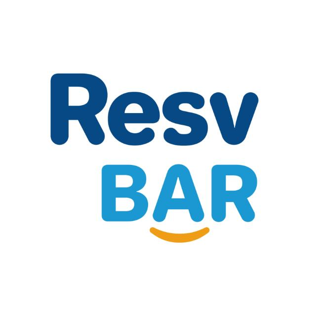

<p align="center">
  
</p>

# ResvBAR — Authentication + Nearby Hotels Map

هذا المشروع هو تطبيق ويب بسيط يتيح للمستخدمين:
- التسجيل وتسجيل الدخول
- عرض خريطة تفاعلية لموقع المستخدم
- إظهار الفنادق القريبة باستخدام **Leaflet + OpenStreetMap / Overpass API**

---

## 🛠 الأدوات والتقنيات المستخدمة
- **Backend:** Laravel 12.50.0 + PHP 8.2
- **Frontend:** HTML, CSS, JavaScript (Vanilla JS)
- **CSS Framework:** Tailwind CSS
- **Map Library:** Leaflet
- **Database:** MySQL
- **Authentication:** Laravel Breeze (Blade)
- **APIs:** OpenStreetMap / Overpass API (للفنادق)
- **Build tools:** Node.js, npm, Vite

---

## ⚡ متطلبات النظام
- PHP >= 8.1
- Composer
- MySQL أو MariaDB
- Node.js (v16+) + npm
- Git

---

## 📦 خطوات الإعداد (محلياً)
1. **استنساخ المشروع وتثبيت تبعيات PHP:**
```bash
git clone <repo-url>
cd auth-map-task
composer install
نسخ ملف البيئة وإعداده:

cp .env.example .env
php artisan key:generate
افتح .env وغيّر إعدادات قاعدة البيانات حسب بيئتك، مثال:

DB_CONNECTION=mysql
DB_HOST=127.0.0.1
DB_PORT=3306
DB_DATABASE=resvbar
DB_USERNAME=root
DB_PASSWORD=
تشغيل المايجريشن لإنشاء الجداول:

php artisan migrate
(اختياري) إذا عندك seeders:

php artisan db:seed
تثبيت تبعيات Node وبناء موارد الواجهة:

npm install
npm run dev
للتجهيز للإنتاج:

npm run build
تشغيل السيرفر المحلي:

php artisan serve
ثم افتح المتصفح على:

http://127.0.0.1:8000
🔐 كيفية الاستخدام (تدفق المستخدم)
افتح /register وأنشئ حساب جديد (name, email, password, password_confirmation).

بعد التسجيل يتم تسجيل الدخول تلقائياً وإعادة التوجيه إلى صفحة الخريطة.

في صفحة الخريطة، سيُطلب منك إذن الموقع — إذا وافقت سيظهر موقعك والعلامات للفنادق القريبة.

في حال رفضت إذن الموقع سيظهر رسالة واضحة تطلب السماح أو توجيه المستخدم لإعدادات المتصفح.

